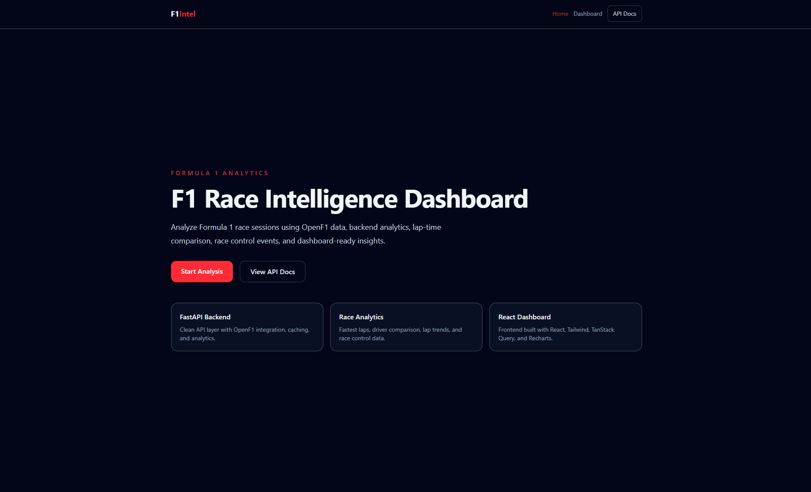
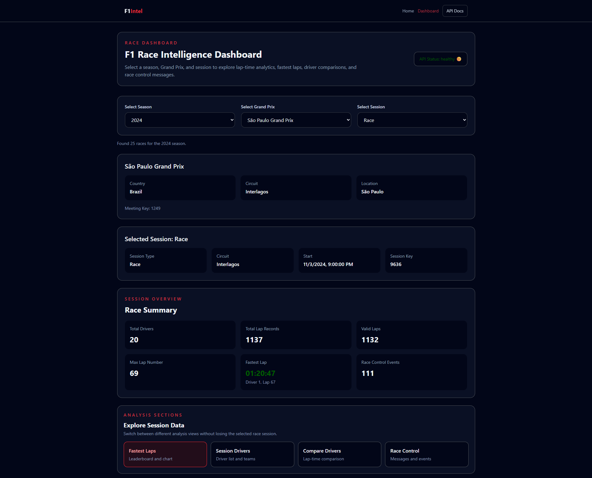
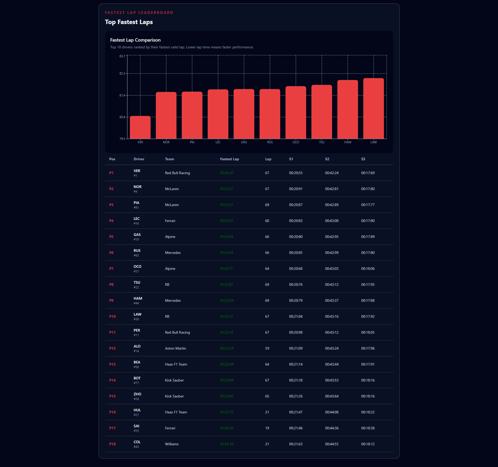
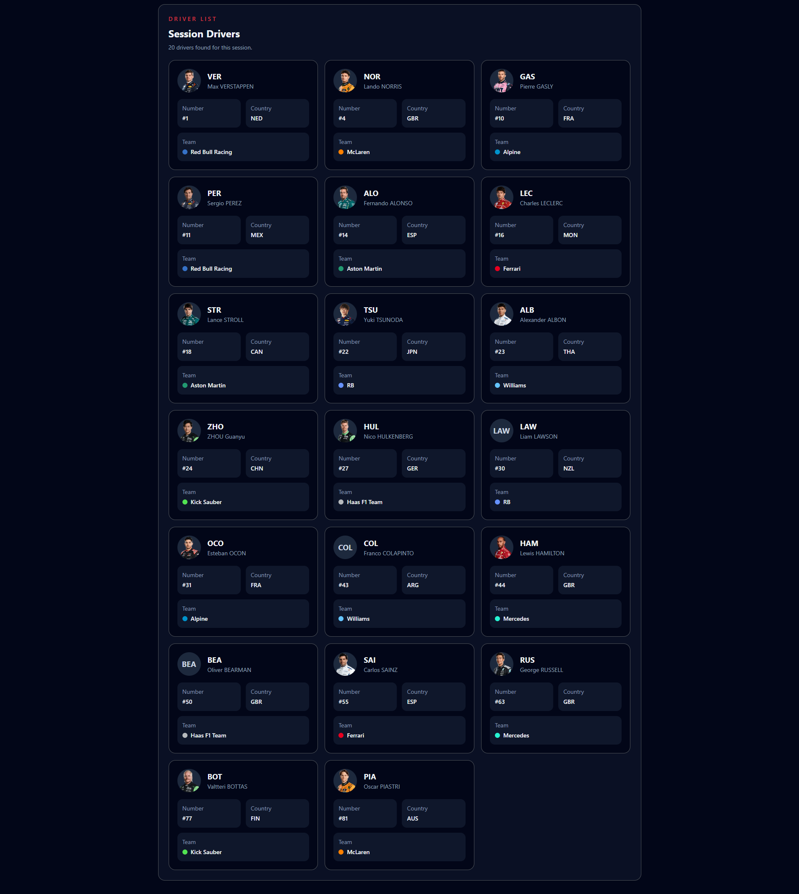
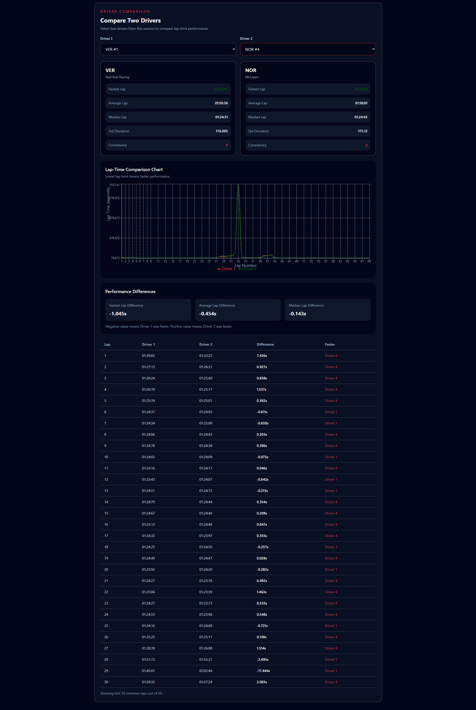
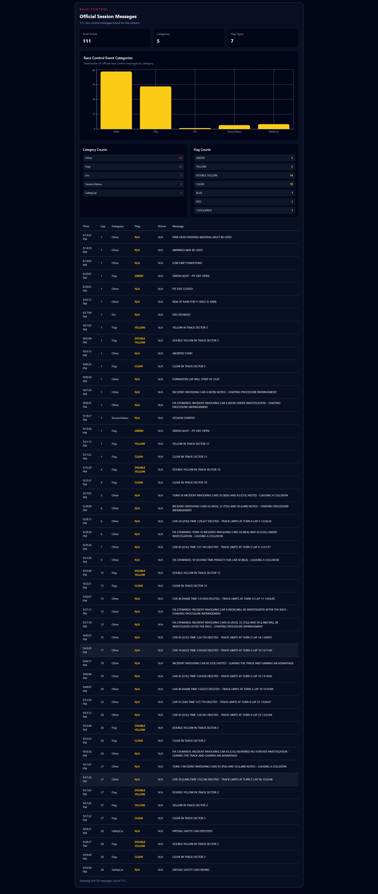

# F1 Race Intelligence Dashboard


A full-stack Formula 1 race analytics dashboard built with FastAPI, React, OpenF1 API, TanStack Query, Recharts, and caching.

The project analyzes Formula 1 race sessions by showing race details, session overview metrics, fastest lap leaderboards, driver lists, driver comparison analytics, lap-time charts, and race control messages.

## Project Purpose

This project is built to demonstrate full-stack software development skills, including:

- Backend API development with FastAPI
- External API integration using OpenF1
- Backend data cleaning and analytics logic
- Caching for repeated API requests
- React frontend development
- Frontend server-state management using TanStack Query
- Data visualization using Recharts
- Clean component-based UI architecture

## Live Demo

- Frontend: https://f1-race-intelligence-dashboard-beta.vercel.app
- Backend API: https://f1-race-intelligence-api.onrender.com
- API Docs: https://f1-race-intelligence-api.onrender.com/docs


## Screenshots

### Home Page



### Dashboard Overview



### Fastest Lap Analysis



### Session Drivers



### Driver Comparison



### Race Control Analysis



## Demo Flow

1. Open the deployed frontend.
2. Select an F1 season.
3. Select a Grand Prix.
4. Select a session such as Race or Qualifying.
5. View the session overview cards.
6. Explore fastest lap leaderboard and fastest lap chart.
7. View all session drivers.
8. Compare two drivers using lap-time analytics.
9. View race control messages and category chart.
10. Refresh or share the dashboard URL with selected filters and active tab preserved.

## Feature Highlights

- URL-driven dashboard filters for year, race, session, and active tab
- Tab-based analytics sections to avoid one long dashboard page
- TanStack Query caching to prevent unnecessary refetching
- FastAPI backend service layer for clean analytics logic
- In-memory cache with TTL for OpenF1 API responses
- Recharts visualizations for lap-time and race-control analysis
- Responsive UI with loading skeletons, empty states, and retryable errors


## Tech Stack

### Frontend

- React
- Vite
- Tailwind CSS
- Axios
- TanStack Query
- React Router
- Recharts

### Backend

- Python
- FastAPI
- Uvicorn
- HTTPX
- python-dotenv


### Data Source

- OpenF1 API

### Caching

- In-memory cache with TTL
- Redis planned for future improvement

## Documentation

- [Architecture](./docs/architecture.md)
- [API Reference](./docs/api-reference.md)

## Current Features

- Season selection
- Grand Prix selection
- Session selection
- Backend health check
- Race details display
- Session details display
- Session overview cards
- Fastest lap leaderboard
- Driver list
- Driver comparison analytics
- Lap-time comparison chart
- Race control messages
- Race control category and flag counts
- Loading, error, and empty states
- Reusable frontend components
- Backend service-layer architecture
- Backend validation and error handling
- In-memory caching layer

## Backend API Endpoints

### Basic

- `GET /`
- `GET /api/health`
- `GET /api/races?year=2024`
- `GET /api/sessions?meeting_key=1234`
- `GET /api/drivers?session_key=1234`
- `GET /api/laps?session_key=1234&driver_number=1`
- `GET /api/race-control?session_key=1234`

### Analytics

- `GET /api/analytics/session-overview?session_key=1234`
- `GET /api/analytics/fastest-laps?session_key=1234`
- `GET /api/analytics/compare-drivers?session_key=1234&driver1=1&driver2=4`

### Cache

- `GET /api/cache/stats`
- `DELETE /api/cache/clear`

## Architecture

The frontend does not directly call OpenF1.

Instead, the data flow is:

```text
React Frontend
↓
FastAPI Backend
↓
Cache Layer
↓
OpenF1 API
```

The backend is responsible for:

- Fetching data from OpenF1
    
- Cleaning and normalizing API responses
    
- Calculating analytics
    
- Handling errors
    
- Caching repeated requests
    
- Returning frontend-ready JSON
    

The frontend is responsible for:

- User interaction
    
- Filters and selections
    
- Loading and error states
    
- Displaying charts, tables, and cards
    

## Local Setup

### Backend Setup

```bash
cd backend
python -m venv venv
```

Activate virtual environment:

```bash
# Windows PowerShell
.\venv\Scripts\Activate.ps1
```

Install dependencies:

```bash
pip install -r requirements.txt
```

Create a `.env` file inside the `backend` folder:

```env
OPENF1_BASE_URL=https://api.openf1.org/v1
FRONTEND_URL=http://localhost:5173
```

Run backend:

```bash
uvicorn app.main:app --reload
```

Backend runs at:

```text
http://127.0.0.1:8000
```

API docs:

```text
http://127.0.0.1:8000/docs
```

### Frontend Setup

```bash
cd frontend
npm install
```

Create a `.env` file inside the `frontend` folder:

```env
VITE_API_BASE_URL=http://127.0.0.1:8000/api
```

Run frontend:

```bash
npm run dev
```

Frontend runs at:

```text
http://localhost:5173
```

## Deployment Plan

The frontend will be deployed on Vercel and the backend will be deployed as a Python web service on Render.

Production environment variables:

Frontend:

```env
VITE_API_BASE_URL=https://your-render-backend-url.onrender.com/api
```

Backend:
```env
OPENF1_BASE_URL=https://api.openf1.org/v1
FRONTEND_URL=https://your-vercel-frontend-url.vercel.app
```


## Project Structure

```text
f1-race-intelligence-dashboard/
│
├── backend/
│   ├── app/
│   │   ├── api/routes/
│   │   ├── core/
│   │   ├── services/
│   │   ├── utils/
│   │   └── main.py
│   ├── .env.example
│   └── requirements.txt
│
├── frontend/
│   ├── src/
│   │   ├── api/
│   │   ├── components/
│   │   ├── hooks/
│   │   ├── pages/
│   │   ├── routes/
│   │   ├── utils/
│   │   └── main.jsx
│   ├── .env.example
│   └── package.json
│
├── docs/
│   └── architecture.md
│
├── .gitignore
└── README.md
```

## Current Status

The project is deployed and MVP-ready.

Completed:

- FastAPI backend deployed on Render
- React frontend deployed on Vercel
- Production CORS configured for deployed frontend domains
- OpenF1 API integration working in production
- Backend service-layer architecture
- Backend validation and error handling
- In-memory caching with TTL
- Dashboard filters with URL query parameters
- Tab-based dashboard navigation
- Session overview cards
- Fastest lap leaderboard
- Fastest lap comparison chart
- Driver list
- Driver comparison analytics
- Lap-time comparison chart
- Race control messages
- Race control category chart
- Loading skeletons
- Error states with retry actions
- Responsive UI polish
    

## Planned Improvements

- Add screenshots and demo GIF to README
- Add Redis caching for production
- Add AI-generated session summary
- Add automated backend tests
- Add frontend component tests
- Add more advanced race analytics
- Improve accessibility
- Add custom domain
    

## MVP Result

The deployed MVP is working end-to-end with a Vercel frontend, Render backend, OpenF1 API integration, analytics endpoints, production CORS configuration, responsive dashboard UI, chart visualizations, loading states, retry handling, and URL-driven dashboard filters.

## Disclaimer

This project uses OpenF1 API data for educational and portfolio purposes.